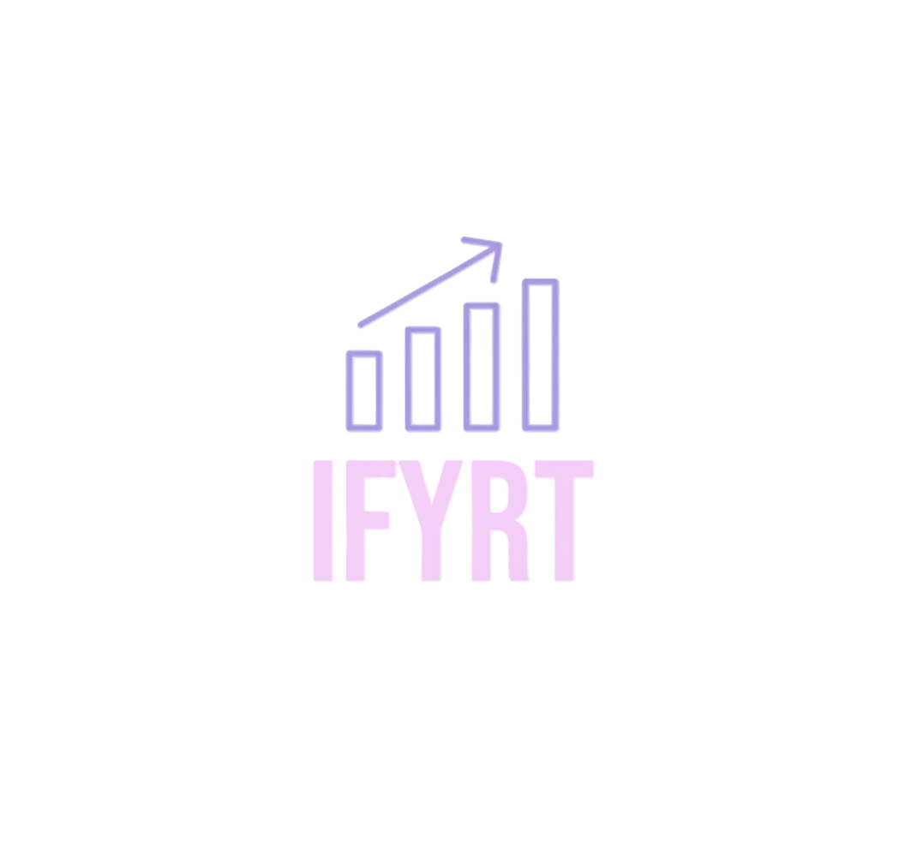

# Ifyrt

Telegram-native trading simulation and live execution platform, built around the design spec in this repository.

The repository now treats the new IFYRT logo as the primary brand asset, and the original planning/spec documents are archived under [`docs/archive/foundation/`](docs/archive/foundation/README.md).

## What is implemented

- npm workspaces monorepo with shared contracts and service utilities
- Telegram bot gateway that parses commands and forwards normalized internal events
- Supabase/Postgres schema with simulation/live separation safeguards
- Deterministic simulation core with order-book-aware market order fills
- Service shells for simulation, live execution, market ingestion, copy routing, and Stripe webhooks

## Workspace layout

```text
apps/
  bot/              Telegram webhook gateway
  sim-worker/       Backtest and simulation HTTP worker
  live-exec/        Isolated live execution service shell
  market-ingestor/  Public market data ingestion service
  copy-worker/      Copy-trading fan-out service
  payments/         Stripe webhook receiver
packages/
  contracts/        Shared event, request, and domain types
  service-core/     Env parsing, service helpers, internal auth
  simulation-core/  Matching engine, strategies, and backtest runner
supabase/
  schema.sql        Database schema for the platform
docs/
  service-contracts.md
  archive/foundation/  Archived source specs and planning docs
assets/
  brand/            Primary logo asset and brand notes
```

## Quick start

1. Install dependencies:

```bash
npm install
```

2. Copy the environment template and fill what you need:

```bash
cp .env.example .env
```

3. Build everything:

```bash
npm run build
```

4. Run a service:

```bash
npm run dev:bot
```

## Notes

- The Telegram bot is intentionally thin: parse, normalize, dispatch.
- The simulation core is usable locally without hosted infrastructure.
- External integrations that need live credentials remain isolated behind their own services.
- Foundational design documents live in [`docs/archive/foundation/`](docs/archive/foundation/README.md) with cleaned-up names for long-term reference.
